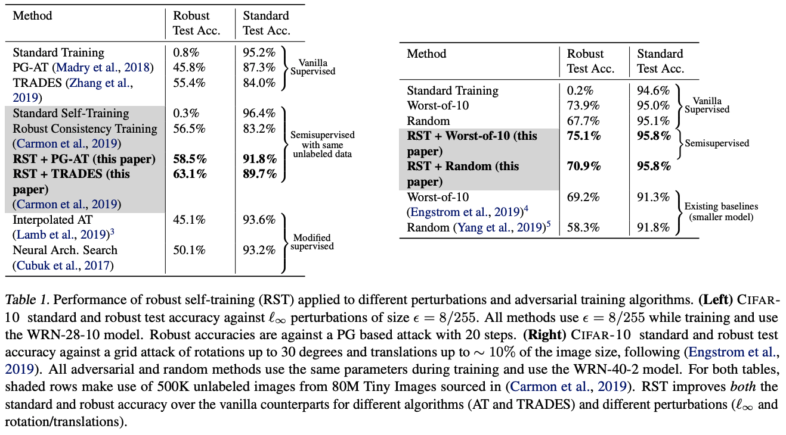

# Understanding and Mitigating the Tradeoff Between Robustness and Accuracy

The repository contains the code for reproducing experiments in the following [paper](https://arxiv.org/abs/2002.10716):
```
@inproceedings{raghunathan2020understanding,
  author = {A. Raghunathan and S. M. Xie and F. Yang and J. C. Duchi and P. Liang},
  booktitle = {International Conference on Machine Learning (ICML)},
  title = {Understanding and Mitigating the Tradeoff Between Robustness and Accuracy},
  year = {2020},
}
```
The experiments in this repository are reproduced in this [CodaLab worksheet.](https://worksheets.codalab.org/worksheets/0x16e1477c039b40b38534353108755541).

## Setup
To get started, please activate a new virtualenv with Python 3.6 or above and install the dependencies using `pip install -r requirements.txt`. The CIFAR experiments are in the `cifar/` directory and the code to reproduce spline simulations and figures are in the `splines` directory. The Dockerfile can also be used to construct a suitable environment to run the code in a personal setup or on CodaLab.

## Description

In this paper, we study empirically-documented tradeoff between adversarial robustness and standard accuracy, where adding adversarial examples during training tends to significantly decrease standard accuracy. The tradeoff is particularly suprising given that the adversarial perturbations are typically very small, such that the true target of the perturbed example does not change. We call these consistent perturbations. Furthermore, since we use powerful neural networks, the model should be expressive enough to contain the true predictor (well-specification).

In this paper we ask, if we assume that perturbations are consistent and the model family is well specified such that there is no inherent trade off, why do we observe a trade off in practice? We can make the following observations and conclusions:

We characterize how training with consistent extra data can increase standard error even in well specified, noiseless linear regression. Our analysis suggests that using unlabeled data with the recent robust self training algorithm can mitigate the tradeoff.
We prove that robust self training improves the robust error without hurting standard error, therefore eliminating the tradeoff in the linear setting using unlabeled data.
Empirically, RST improves both robust and standard error across different adversarial training algorithms and perturbations.


