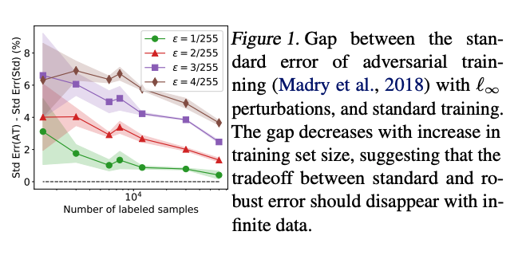

# CIFAR experiments

The scripts in this directory run standard training, adversarial training (PG-AT), and robust self-training on CIFAR-10. Please refer to [this repo](https://github.com/yaircarmon/semisup-adv) for TRADES + RST experiments.

## Code descriptions
- `run_*_for_sample_size.sh` scripts run a WRN-40-2 model over different labeled sample sizes.
- `run_{pgat,selftrain}.sh` scripts run a WRN-28-10 model on L-inf adversarial perturbations. These scripts run the projected gradient adversarial training, and self-training (semi-supervised) algorithms respectively. ThePG-AT script also runs the semi-supervised version of the algorithm with RST.
- `run_rotations.sh` runs standard training, PG-AT adversarial training, and PG-AT + RST on spatial adversarial examples, i.e. translation and rotation perturbations.
- `code/` contains all the code for standard, adversarial, and RST training.
- We also include many scripts for running on CodaLab, where the main runner is `run_cl.sh`.

## Data
- [500K unlabeled data from TinyImages (with pseudo-labels)](https://drive.google.com/open?id=1LTw3Sb5QoiCCN-6Y5PEKkq9C9W60w-Hi): unlabeled data, which is also provided in this [Codalab worksheet.](https://worksheets.codalab.org/worksheets/0x16e1477c039b40b38534353108755541)

Here, we plot the effect of sample size on generalization of robust models on clean examples. As the number of labeled examples increases, the drop in standard accuracy between the adversarially-trained (PG-AT) model and the standard-trained model gets smaller. This suggests that the tradeoff in standard accuracy is an issue of generalization.

Using robust self-training (RST+AT) not only mitigates the increase in test error from AT but even improves test error beyond that of the standard estimator.

