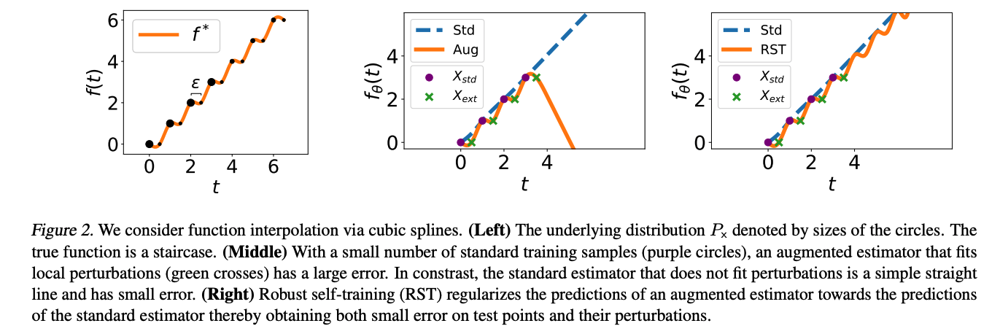

# Spline simulations

## Code descriptions
- `fig2_spline.py` produces Figure 2 in our paper.
- `fig3478_spline.py` produces the spline figures in Figures 3,4,7,8 in our paper.
- `spline_tradeoff.py` produces Figure 6a in our paper.

## Spline staircase example

The spline staircase is an illustrative example of the tradeoff with cubic smoothing splines. The underlying distribution is denoted by sizes of the circles. The true function is a staircase.

With a small number of standard training samples (purple circles), an augmented estimator that fits local perturbations (green crosses) has a large error. In constrast, the predictor obtained via standard training (dashed blue) is a line that captures the global structure and obtains low error. Training on augmented data with locally consistent perturbations of the training data (crosses) restricts the hypothesis class by encouraging the predictor to fit the local structure of the high density points. Within this set, the cubic splines predictor (solid orange) minimizes the second derivative on the augmented data, compromising the global structure and performing badly on the tails.

In the paper we study the general min-norm linear regression setting, characterizing when adversarial perturbations can hurt performance in this setting. We can use the theory to understand the spline example, which is linear in the spline basis. See our [CodaLab worksheet.](https://worksheets.codalab.org/worksheets/0x16e1477c039b40b38534353108755541) for more details.

Robust self-training (RST) regularizes the predictions of an augmented estimator towards the predictions of the standard estimator thereby obtaining both small error on test points and their perturbations. We can see its effect on the spline problem below, allowing the estimator to fit the local perturbations while also continuing the global linear structure of the (blue) standard estimator.
